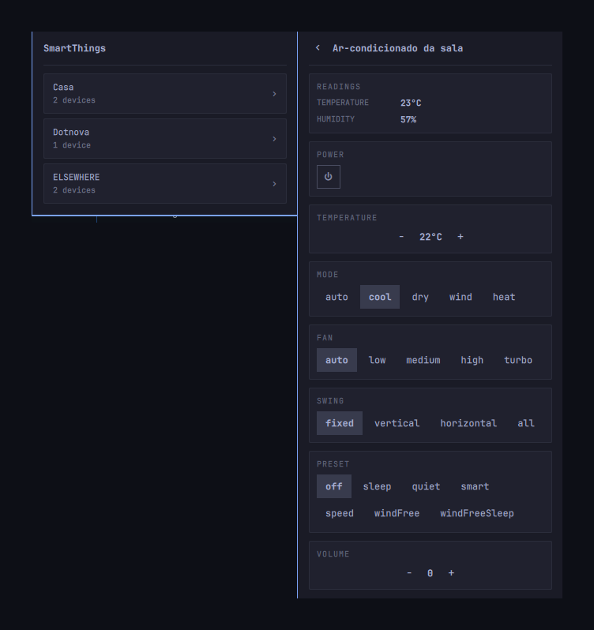

# SmartThings

<p align="center">
  
</p>

Every device in a SmartThings account from the Omarchy bar — grouped by room,
each one showing the controls it actually publishes. The bar shows how many
are on.

Nothing here is keyed on a device type, model or vendor. A control is earned by
a published capability, so a device offering different values shows different
buttons with no code change, and a device that publishes nothing usable shows
no control rather than a dead one — a television lists no input sources while it
is off, and the input picker simply is not there until it does.

## What it controls

Whatever the account publishes, from this set:

| Capability | Control |
|---|---|
| `switch` | power |
| `switchLevel` | level |
| `thermostatCoolingSetpoint` | target temperature, range read from the device |
| `airConditionerMode`, `airConditionerFanMode`, `fanOscillationMode`, `custom.airConditionerOptionalMode` | mode, fan, swing, preset |
| `audioVolume`, `audioMute` | volume, mute |
| `mediaPlayback`, `mediaTrackControl`, `mediaInputSource` | transport, track, input |

Read-only: temperature, humidity, a feels-like figure from the NWS heat index,
illuminance, presence, battery, channel.

## What it does not do

Scenes and automations, renaming devices or moving rooms, and vendor extras
such as Samsung's art and ambient modes. Generality is the point; a
Samsung-specific control belongs in a Samsung-specific plugin.

## Requirements

- Omarchy 4 (Quattro)
- `curl`, `jq`, `libsecret` (`secret-tool`) — all present on a default install
- A SmartThings personal access token

## Install

```bash
omarchy plugin add https://github.com/artur-hash/omarchy-smartthings.git --enable
```

Then add the widget to the bar from the shell's own widget settings.

## Setup

Two ways to give the plugin a credential. It prefers the first.

### The SmartThings CLI — the one that lasts

```bash
npm install -g @smartthings/cli
smartthings locations
```

Log in when the browser opens. The CLI holds an OAuth session that renews
itself, and this plugin reads it — the same arrangement as tools that rely on
`gcloud auth` or `gh auth login`. Nothing to paste, and nothing expires.

Install it **globally**, not through `npx`: the plugin only reads the stored
session, and the CLI only renews it when one of its own commands runs. Without
`smartthings` on `PATH` the session works for a day and then dies like a pasted
token. `smartthings doctor` says so if that happens.

### A personal access token — quick, and gone tomorrow

Create one at
[account.smartthings.com/tokens](https://account.smartthings.com/tokens) with
the device scopes (list, read, execute) and the location read scope, and paste
it into the panel. It is read from stdin, never passed as an argument, and
stored in the login keyring under service `smartthings`.

**SmartThings expires it 24 hours after it is created.** Tokens issued before
30 December 2024 could last fifty years; new ones cannot. So this is a daily
chore, and it is a property of the credential rather than of this plugin.

### If your home was shared with you

The obvious third option — have the plugin register its own OAuth app — does
not work for everyone, and the way it fails is worth knowing before you spend
an evening on it.

Authorising a third-party app means installing it **into a location you own**.
If someone else set up the home and shared it with you, you own none, and the
consent screen refuses: *"at least one location is required"* on mobile, and
the considerably less helpful *"it looks like you have not set up a SmartThings
account"* on desktop. Your devices are right there and read and control
perfectly; only app authorisation is closed to you.

The CLI route sidesteps this entirely, because its own client installs with no
location at all. For a shared member it is not the better option — it is the
only one that lasts.

### Rooms

Room names live behind the location read scope. Without it everything still
works and the devices are simply not grouped. With it, devices are grouped
under their room, and when the account holds more than one location the
location leads the heading — `Casa · hashLabs` — because two places can each
have a room by the same name.

## What the backend trusts

Nothing the network says, beyond its shape.

`omarchy-shell` is one long-lived process shared by every widget, and the QML
side collects this helper's whole stdout. A response with no ceiling is
therefore a way for whatever answers on the socket to exhaust the shell, not
just this plugin. The ceiling is enforced while the response is arriving rather
than after it has been read, and an overflow fails closed — a truncated body is
never parsed, guessed at, or passed on.

Past that, every value forwarded to the panel is clamped: strings to 128
characters, lists to 64 entries, the device list to 200 rows.

Writes are never assumed. The API answers `200` for a command it refuses, and a
device answers `COMPLETED` for a command it then silently drops — an air
conditioner ignores a setpoint while it is off. Every write is read back a few
seconds later, and the panel says when the device did not apply it rather than
leaving a button claiming a state nothing checked.

## Requests are the scarce resource

There is no bulk status endpoint: `GET /devices/status` and
`GET /devices/health` both answer HTTP 400, so status costs one request per
device. This shapes the design more than anything else.

- The device list is structure only, read once per session.
- Status is fetched only for devices whose state is on screen.
- Reachability is a separate call the panel makes only where it changes what
  is shown.
- Reads are sequential inside one backend process, never a fan-out of
  concurrent children: the limit that bites is a burst limit.
- Polling follows attention — twenty seconds with the panel open, ninety
  without — and backs off exponentially on HTTP 429.

## Diagnostics

```bash
~/.config/omarchy/plugins/io.github.artur-hash.smartthings/bin/smartthings doctor
```

Reports the dependencies, whether a token is stored (redacted), how many
devices are visible, and whether the token carries the location scope.

## Removal

```bash
omarchy plugin remove io.github.artur-hash.smartthings
```

Deleting the directory is enough. `smartthings token clear` removes the stored
token.

## Tests

```bash
bash tests/test_smartthings.sh   # backend, against a faked API and keyring
node tests/test_model.js         # the capability registry and everything pure
```

## License

MIT.
